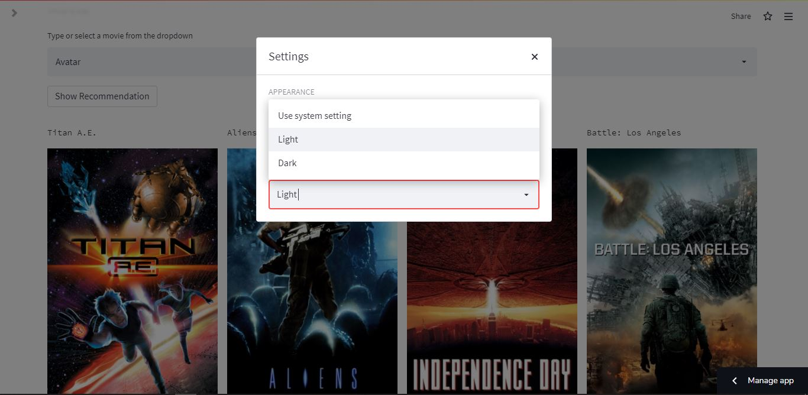

# ALL-IN-ONE RECOMMENDER 🎥 🎵 📚

A web App deployed on Streamlit CLoud ,that recommends MOVIES, SONGS and BOOKS.

You can try out this app [here.] https://share.streamlit.io/palak296/recommendation_system/main/app.py


# Build with
[](https://www.python.org/downloads/release/python-380/)


### Project overview
In this project, I have designed a recommendation system that recommends MOVIES, SONGS and BOOKS based on the input given by the user, this is a content based recommendation system.
This system also shows Details of the recommended output .In this system the recommendation is made by using Cosine Similarity function

### Datasets Used

Below are the links used to train the Recommender model

Movie dataset :- 'https://www.kaggle.com/datasets/tmdb/tmdb-movie-metadata'

Book dataset :- 'https://zenodo.org/record/4265096'

Song dataset :- 'https://www.kaggle.com/datasets/saurabhshahane/spotgen-music-dataset'


### What is Cosine Similarity?

Mathematically Cosine similarity measures the similarity between two vectors of an inner product space. It is measured by the cosine of the angle between two vectors and determines whether two vectors are pointing in roughly the same direction. It is often used to measure document similarity in text analysis.

In Python the cosine similarity measures the similarity between vector lists by calculating the cosine angle between the two vector lists. If you consider the cosine function, its value at 0 degrees is 1 and -1 at 180 degrees. This means for two overlapping vectors, the value of cosine will be maximum and minimum for two precisely opposite vectors.

You can get more information about cosine Similarity [here.](https://www.delftstack.com/howto/python/cosine-similarity-between-lists-python/#use-the-scipy-module-to-calculate-the-cosine-similarity-between-two-lists-in-python)
Here I have used [cosine_similarity](https://scikit-learn.org/stable/modules/generated/sklearn.metrics.pairwise.cosine_similarity.html) function from sklearn.

```python
from sklearn.metrics.pairwise import cosine_similarity

similarity = cosine_similarity(vector)
similarity
```

###  Feature extraction (or vectorization)
Scikit-learn’s CountVectorizer is used to convert a collection of text documents to a vector of term/token counts. It also enables the pre-processing of text data prior to generating the vector representation. This functionality makes it a highly flexible feature representation module for text.
You can get more information about cosine Similarity [here.](https://www.educative.io/edpresso/countvectorizer-in-python)
Here I have done vectorization using [CountVectorizer](https://scikit-learn.org/stable/modules/generated/sklearn.feature_extraction.text.CountVectorizer.html) function from sklearn

```python
from sklearn.feature_extraction.text import CountVectorizer
cv = CountVectorizer(stop_words='english')
vector = cv.fit_transform(new['tags']).toarray()
```


Than I made a function which gives the recommendation based on the given input.
```python
def recommend(movie):
    index = new[new['title'] == movie].index[0]
    distances = sorted(list(enumerate(similarity[index])),reverse=True,key = lambda x: x[1])
    for i in distances[1:7]:
        print(new.iloc[i[0]].title)
```

## Features
- 3 major recommendations between which the user can toggle anytime
- Added authentication
- Sort on the basis of popularity
- Gives detailed overview along with genres, cast, rating, description etc.
- Ability to show or hide the lyrics for each song
- Ability to switch the width of the main content area
- Ability to choose between a pastel, light and dark theme.
- Handy hamburger menu with options to report a bug, share the web app, view source code, read about it, see credits, etc
- Cross Platform & Responsive - The site works and looks pretty on any device it is viewed on, irrespective of screen shape and size

 # Flow of Application
 ### Selection of Input
 The app assists in selection of input (Movie, Song, Book)

### Recommended Output
The app shows recommendation based on the given input.

### Detailed Recommended Output
The app also shows respective details based on the recommended output.

# Theme
The app also has feature to change its Theme , we can select white theme or dark theme or device oriented theme


## Development Timeline

- Week 1 - Research and ideation
- Week 2 - Visualising the data in jupyter notebook/Backend Development
- Week 3 - streamlit frontend, initially focusing on displaying all the recommendations appropriately
- Week 4 - Deployement and Submission
 
## Run Locally

Clone the project

```bash
  git clone git@github.com:abhishekg495/RecommenderSystem.git
```

Go to the project directory

```bash
  cd RecommenderSystem
```

Install dependencies

```bash
  pip install -r requirements.txt
```

Start the server

```bash
  streamlit run main.py
  ```
CREDENTIALS FOR AUTHENTICATON :
```
username : palak
password : test1234
```
```
username : plk
password : abcd1234
```
